# GenAI Course — Complete Beginner Notes
### Your Personal Tutor Guide (Start Here)

> **How to use this file:** Read top to bottom. Every section builds on the previous one. When you see a diagram, study it before moving on. When you see a code block, map it to the actual file.

---

## Table of Contents

1. [The Big Picture — What Is This Course?](#1-the-big-picture)
2. [Core Vocabulary You Must Know](#2-core-vocabulary)
3. [The Tech Stack — What Tools Are Used?](#3-the-tech-stack)
4. [How to Set Up the Project](#4-setup)
5. [Module 1 — Basic Agent (News Reporter)](#5-module-1--basic-agent)
6. [Module 2 — Agent With Tools (Finance Agent)](#6-module-2--agent-with-tools)
7. [Module 3 — Reasoning Agent](#7-module-3--reasoning-agent)
8. [Module 4 — Multimodal Agent (Images)](#8-module-4--multimodal-agent)
9. [Module 5 — Evaluations (Functional)](#9-module-5--evaluations-functional)
10. [Module 6 — Evaluations (LLM as Judge)](#10-module-6--llm-as-judge)
11. [Module 7 — Evaluation Operational Metrics](#11-module-7--operational-metrics)
12. [Module 8 — Guardrails (Safety)](#12-module-8--guardrails)
13. [How Everything Connects](#13-how-everything-connects)
14. [Quick Reference Cheat Sheet](#14-cheat-sheet)

---

## 1. The Big Picture

This is a hands-on course on building **AI Agents** — programs that can think, decide, and take actions to complete tasks.

Think of it like this:

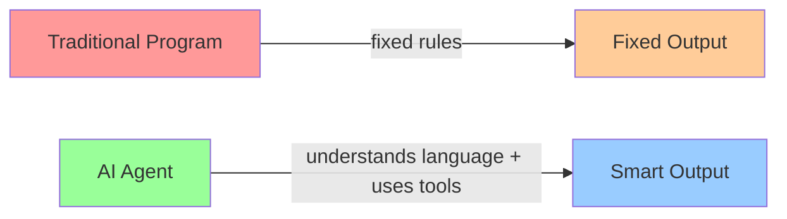

**Traditional programs** follow exact instructions: `if X then do Y`.  
**AI Agents** understand natural language, reason about a problem, and decide which steps to take.

### The Learning Journey of This Course

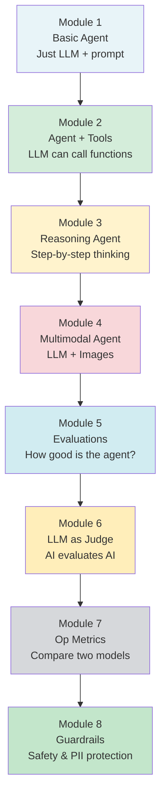

---

## 2. Core Vocabulary

These are words you will see everywhere. Learn them now.

| Term | Plain English Explanation |
|------|--------------------------|
| **LLM** (Large Language Model) | The "brain" — a giant AI trained on the internet that understands and generates text. Examples: GPT-4, Qwen, LLaMA |
| **Agent** | A program that uses an LLM to think + can take actions (like searching the web, calling an API) |
| **Tool** | A function that an agent can call to do something (search Google, check stock price, look up inventory) |
| **Prompt** | The text instructions you give to an LLM. It shapes the LLM's personality and behavior |
| **System Prompt** | Background instructions given to the LLM before the user speaks. Defines the agent's "job" |
| **Temperature** | Controls randomness of the LLM. `0` = very consistent/predictable. `1` = more creative/random |
| **Token** | A chunk of text (roughly 1 word or part of a word). LLMs read and generate tokens |
| **API** | A way to call a service over the internet. `GROQ_API_KEY` lets you call the Groq AI service |
| **API Key** | A secret password that lets you access a paid service like Groq or SerpAPI |
| **Hallucination** | When an LLM makes up facts that are false but sounds confident. A major challenge in AI |
| **PII** | Personally Identifiable Information — email, credit card, phone number, etc. |
| **Embedding** | Turning text into a list of numbers so a computer can measure how "similar" two texts are |
| **Cosine Similarity** | A math formula that compares two embeddings to get a score from 0 (different) to 1 (identical) |
| **Evaluation / Evals** | Testing how good your AI agent actually is at its job |
| **Guardrail** | A safety rule that blocks or filters dangerous/sensitive content |
| **Middleware** | Code that runs automatically in the middle — between user input and the model, or between model and output |
| **Multimodal** | An AI that can work with more than one type of data: text + images, text + audio, etc. |
| **Inference** | Running the LLM to get an answer (as opposed to training it) |
| **LangChain** | A Python library that makes it easy to build AI agents. It handles the "wiring" |
| **LangSmith** | A platform for logging, tracing, and evaluating AI agents (built by the LangChain team) |
| **Groq** | A company that runs LLMs very fast (free tier available). This course uses Groq to run models |
| **SerpAPI** | A service that lets you call Google Search from code and get structured results |
| **yfinance** | A Python library that fetches stock market data from Yahoo Finance |
| **dotenv** | A way to load secret keys from a `.env` file into your program — keeps secrets out of code |
| **Base64** | A way to encode binary files (like images) into text so they can be sent in an API call |
| **JSON** | JavaScript Object Notation — a common format for structured data: `{"key": "value"}` |

---

## 3. The Tech Stack

Here is every tool/library used in this project and why:

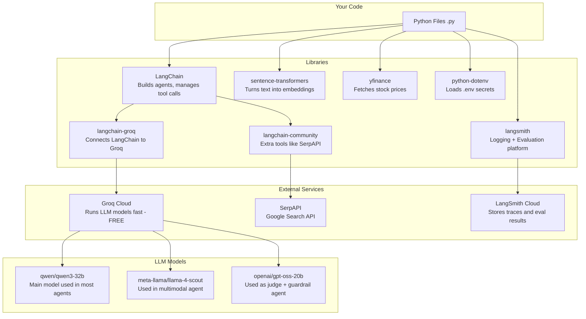

### The `.env` File and `sample.env`

**Never put API keys directly in your code.** Instead:

1. Copy `sample.env` to `.env`
2. Fill in your actual keys
3. The `.gitignore` file makes sure `.env` is never uploaded to GitHub

```
# sample.env shows you the format:
GROQ_API_KEY=<your groq key here>         # Get free at console.groq.com
SERPAPI_API_KEY=<your serp api key here>  # Get at serpapi.com
HF_TOKEN=<your HF Token here>             # Hugging Face - for some models
LANGSMITH_API_KEY=<your langsmith key here> # Get at smith.langchain.com
```

---

## 4. Setup

### Project Structure

```
course-gen-ai-main 2/
│
├── .env                    ← Your secret keys (never share this!)
├── sample.env              ← Template showing what keys are needed
├── .gitignore              ← Tells git to ignore .env
├── .python-version         ← Python 3.13 required
├── pyproject.toml          ← Lists all Python dependencies
├── uv.lock                 ← Exact versions of packages (like a receipt)
│
├── 1_first_agent/
│   └── basic_agent.py      ← Module 1: News reporter agent
│
├── 2_agent_with_tools/
│   └── agent_with_tools.py ← Module 2: Finance agent with stock tools
│
├── 3_reasoning_agent/
│   └── reasoning_agent.py  ← Module 3: Step-by-step math/reasoning
│
├── 4_multimodal_agent/
│   ├── multimodal_1.py     ← Module 4a: Identify animal from URL
│   ├── multimodal_2.py     ← Module 4b: Analyze clothing images + JSON output
│   └── Images/             ← Sample images used by multimodal_2.py
│
├── 5_evals_func/
│   ├── inventory_agent.py  ← The agent being tested
│   ├── func_eval.py        ← Evaluation using cosine similarity
│   └── utils.py            ← Cosine similarity helper function
│
├── 6_evals_func_llm_judge/
│   ├── inventory_agent.py  ← Same agent
│   ├── func_eval_llm_judge.py ← Evaluation using another LLM as judge
│   └── utils.py            ← Same cosine similarity helper
│
├── 7_eval_op_metrics/
│   ├── inventory_agent.py  ← Same agent but switched to GPT model
│   ├── func_eval.py        ← Same cosine evaluator (now tests GPT model)
│   └── utils.py            ← Same helper
│
└── 8_guardrails/
    ├── guardrails_1.py     ← PII redaction/masking on customer data
    └── guardrails_2.py     ← API key blocking in user messages
```

### How to Run

```bash
# Install dependencies (using uv - a fast Python package manager)
uv sync

# Run any module
python 1_first_agent/basic_agent.py
python 2_agent_with_tools/agent_with_tools.py
# ...etc
```

---

## 5. Module 1 — Basic Agent

**File:** `1_first_agent/basic_agent.py`

**What it does:** A news reporter agent that searches Google News and summarizes the latest breaking news.

### The Anatomy of an Agent

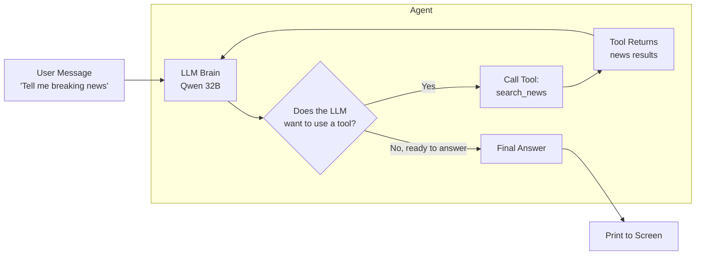

### Code Breakdown

```python
# 1. Load secrets from .env file
from dotenv import load_dotenv
load_dotenv()

# 2. Create the LLM — the brain
llm = ChatGroq(model="qwen/qwen3-32b", temperature=0)
#              ^ model name on Groq   ^ 0 = consistent, not random

# 3. Create a tool — a function the LLM can choose to call
@tool
def search_news(query: str) -> str:
    """Search last-24h Google News via SerpAPI."""
    # The docstring IS the tool description — the LLM reads this
    # to decide WHEN to call this tool
    return serp.run(query)

# 4. Create the agent — wire LLM + tools + personality
agent = create_agent(
    tools=[search_news],        # what tools it has
    model=llm,                  # which brain
    system_prompt="You are a news reporter..."  # personality
)

# 5. Run the agent with a user message
result = agent.invoke({
    "messages": [{"role": "user", "content": "Tell me breaking news..."}]
})

# 6. Get the final answer
print(result["messages"][-1].content)
#                         ^ -1 means "the last message" in the list
```

### Key Insight — The `@tool` decorator

The `@tool` decorator does something magical: it takes a regular Python function and wraps it so that:
1. The LLM can "see" it as an available action
2. The LLM reads the **docstring** (the text in `"""..."""`) to understand when to use it
3. When the LLM decides to call it, LangChain executes the actual Python function

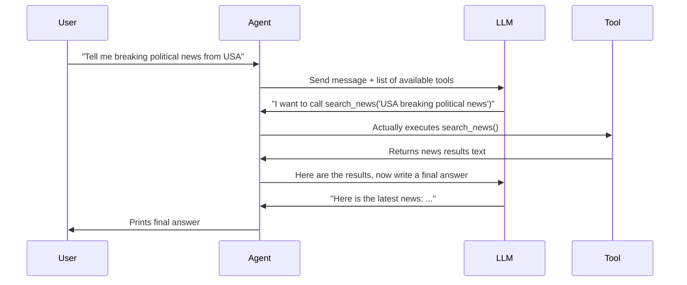

---

## 6. Module 2 — Agent With Tools

**File:** `2_agent_with_tools/agent_with_tools.py`

**What it does:** A finance agent with two tools — one for public stocks (via Yahoo Finance) and one for private company valuations (hardcoded lookup table).

### Two Tools, One Agent

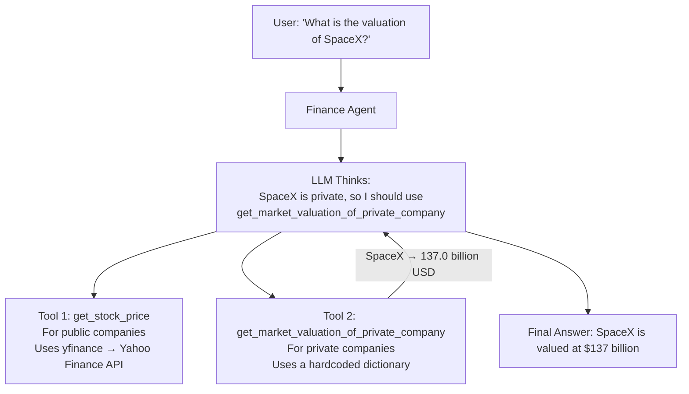

### How the LLM Picks the Right Tool

This is one of the most important concepts. The LLM doesn't randomly pick a tool — it reads the **docstring** and decides based on logic:

```python
@tool
def get_stock_price(ticker: str) -> str:
    """Get the current stock price for a given ticker symbol."""
    # LLM uses this for: Apple (AAPL), Tesla (TSLA), etc.
    
@tool
def get_market_valuation_of_private_company(company_name: str) -> str:
    """Return the market valuation of a private company in billion USD."""
    # LLM uses this for: SpaceX, Stripe, Airbnb (not on stock market)
```

The LLM understands:
- SpaceX is NOT publicly traded → use `get_market_valuation_of_private_company`
- Apple IS publicly traded → use `get_stock_price` with ticker "AAPL"

### Placeholder Data (Important for Learning)

Notice this code in the tool:

```python
company_valuations = {
    "SpaceX": 137.0,
    "Stripe": 95.0,
    "Airbnb": 100.0,
}
```

This is **fake/hardcoded data** used for teaching. In a real product, you would connect to a real database or API. Placeholder functions let you test the agent logic without needing real data.

---

## 7. Module 3 — Reasoning Agent

**File:** `3_reasoning_agent/reasoning_agent.py`

**What it does:** An agent with NO tools — it uses pure reasoning to solve problems step by step.

### The Core Idea — Chain of Thought

Without tools, the LLM must reason through problems on its own. This is called **Chain of Thought (CoT)** reasoning — forcing the AI to show its work.

```python
system_prompt="""
You are an advanced reasoning assistant.
List out all the steps you carry to reason with numbers
If you're using any formula, it should not be in Latex but plain formulas
"""
```

The user asks: *"How much time will it take a cheetah to travel from New Delhi to Mumbai?"*

The LLM must reason:
1. What is the distance from New Delhi to Mumbai? (~1400 km)
2. What is a cheetah's top speed? (~120 km/h)
3. Can a cheetah run at top speed the whole way? No — it can sprint for only ~300–400 meters
4. Average sustained speed for a cheetah over long distances? Much lower
5. Calculate: Distance / Speed = Time

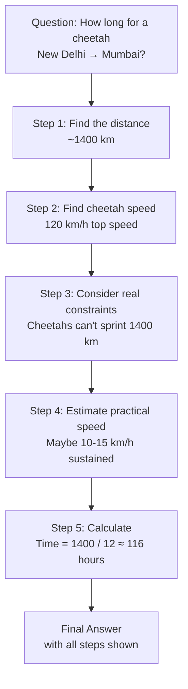

### Why No Tools Here?

Some problems don't need external data. Math, estimation, logical deduction — these can all be done purely by thinking. Removing tools forces the LLM to reason rather than look things up.

---

## 8. Module 4 — Multimodal Agent

**Files:** `4_multimodal_agent/multimodal_1.py` and `multimodal_2.py`

**What it does:** Agents that can understand images, not just text.

### multimodal_1.py — Simple Image URL

The simplest case: give the LLM a URL to an image and ask a question.

```python
agent.invoke({
    "messages": [{
        "role": "user",
        "content": "which animal is in this image? https://www.nycgovparks.org/.../chipmunk.jpeg"
    }]
})
# Output: "Chipmunk"
```

The model (Qwen 32B with vision capabilities) downloads and analyzes the image directly.

### multimodal_2.py — Local Images + Structured Output

More complex: read images from local files, encode them as Base64, send multiple images in one request, and get structured JSON output back.

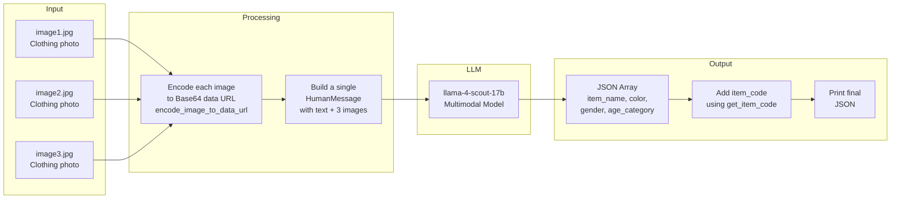

### What is Base64?

When you send an image in an API call (text-only channel), you can't send raw binary. Base64 converts the image bytes into a text string like:

```
data:image/jpeg;base64,/9j/4AAQSkZJRgABAQEASABIAAD/...
```

The LLM service receives this text, decodes it back to an image, and analyzes it.

### The Business Logic — `get_item_code()`

After the LLM identifies the clothing type, the code automatically maps it to an internal inventory code:

```python
def get_item_code(item_name: str) -> str:
    if item_name == "sari":     return "ITM001"
    if item_name == "t-shirt":  return "ITM002"
    if item_name == "jeans":    return "ITM003"
    if item_name == "jacket":   return "ITM004"
    return "ITM999"  # unknown
```

This shows a real-world pattern: **LLM extracts information → code does business logic**. Never rely on the LLM for critical business logic like IDs or pricing — let it understand the data, then process it in normal code.

---

## 9. Module 5 — Evaluations (Functional)

**Files:** `5_evals_func/`

**What it does:** Systematically tests if the inventory agent gives correct answers using **cosine similarity** to compare expected vs actual answers.

### Why Do We Need Evaluations?

When you change your agent (different model, different prompt, different tools), how do you know it got better or worse? You need **evals** — a repeatable test suite.

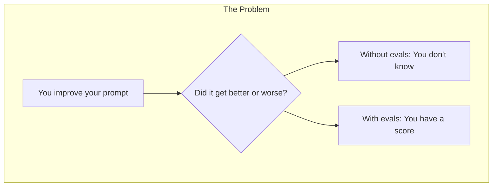

### How This Evaluation Works

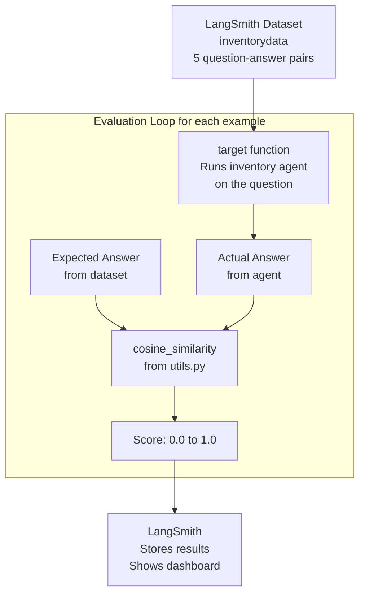

### The Dataset — 5 Test Cases

```python
examples = [
    # Normal cases
    {"inputs": {"question": "What is the stock status of iPhone 15?"},
     "outputs": {"answer": "The iPhone 15 is currently in stock with 2 units available."}},
    
    {"inputs": {"question": "Is AirPods Pro available?"},
     "outputs": {"answer": "The AirPods Pro is currently out of stock."}},

    # Edge case: product not in system
    {"inputs": {"question": "Do you have Samsung Galaxy S23?"},
     "outputs": {"answer": "The product is not available in our inventory"}},
    
    # Out-of-scope question — agent should refuse
    {"inputs": {"question": "Can you tell me the recipe of Vada Pav?"},
     "outputs": {"answer": "Sorry, I can't assist with that"}},
]
```

### Cosine Similarity — The Math Made Simple

**utils.py** contains the evaluation math:

```python
from sentence_transformers import SentenceTransformer
import numpy as np

_model = SentenceTransformer("all-MiniLM-L6-v2")
# This loads a small embedding model that runs locally (no API needed)

def cosine_similarity(sentence1: str, sentence2: str) -> float:
    embeddings = _model.encode([sentence1, sentence2])
    # Each sentence becomes a list of 384 numbers
    # Similar sentences have similar number patterns
    
    a, b = embeddings[0], embeddings[1]
    similarity = np.dot(a, b) / (np.linalg.norm(a) * np.linalg.norm(b))
    # This formula measures the angle between the two vectors
    # Same direction = 1.0, opposite direction = 0.0
    
    return float(np.clip(similarity, 0.0, 1.0))
```

**Intuition:**
- `"The iPhone 15 is in stock with 2 units"` vs `"iPhone 15 is available, 2 items"` → score ~0.95 (same meaning)
- `"iPhone 15 is in stock"` vs `"Recipe for Vada Pav is..."` → score ~0.10 (completely different)

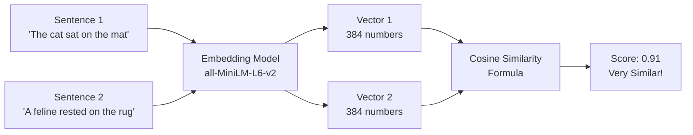

---

## 10. Module 6 — LLM as Judge

**File:** `6_evals_func_llm_judge/func_eval_llm_judge.py`

**What it does:** Instead of using a math formula to evaluate, uses a separate LLM (the "judge") to score the agent's answers.

### Two Ways to Evaluate

| Method | Module 5 (Cosine) | Module 6 (LLM Judge) |
|--------|-------------------|----------------------|
| How it works | Math formula on word embeddings | Another LLM reads the answer and scores it |
| Speed | Fast (local computation) | Slower (another API call) |
| Best for | Factual, short answers | Nuanced, open-ended answers |
| Cost | Free (local model) | Costs money (API call) |
| Understands context? | No — only word similarity | Yes — can reason about meaning |

### The Judge Prompt

```python
JUDGE_PROMPT = """You are a helpful and precise assistant for checking the correctness of the answer.

    Question: {question}
    Expected Answer: {expected}
    Actual Answer: {actual}

    Please compare the actual answer with the expected answer and give a score between 0 and 1.
    Return ONLY valid JSON like:
    {"score": <number>}.
"""
```

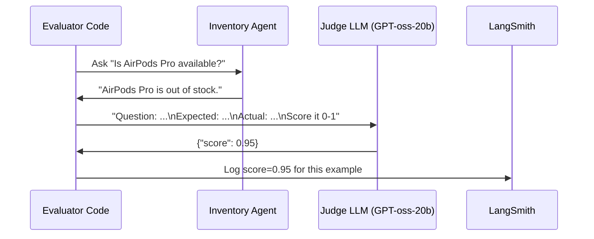

### Why Use a Different Model as Judge?

Notice the judge uses `openai/gpt-oss-20b` while the agent uses `qwen/qwen3-32b`. This is intentional:
- If you use the **same** model to evaluate itself, it tends to score itself too high (bias)
- A **different** model gives a more objective perspective
- This mirrors how in school, a different teacher grades your exam — not you

---

## 11. Module 7 — Operational Metrics

**File:** `7_eval_op_metrics/`

**What it does:** Runs the same evaluation (cosine similarity) but switches the **agent's model** from Qwen to GPT-oss-20b. This lets you compare two models head-to-head.

### The Only Change

In `7_eval_op_metrics/inventory_agent.py`:

```python
# Module 5 agent used:
llm = ChatGroq(model="qwen/qwen3-32b", temperature=0)

# Module 7 agent uses:
llm = ChatGroq(model="openai/gpt-oss-20b", temperature=0)
```

Everything else is the same. The evaluation in `func_eval.py` uses:
```python
experiment_prefix="inventory_agent_evaluation_gpt-oss-20b"
# vs Module 5's: "inventory_agent_evaluation_qwen3-32b"
```

### What You Learn From Comparing

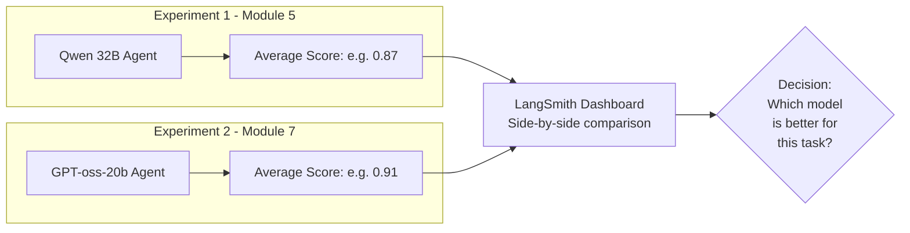

**Operational metrics** = metrics that help you make production decisions:
- Which model is more accurate?
- Which model is faster?
- Which model is cheaper per call?
- Which model follows instructions better?

---

## 12. Module 8 — Guardrails

**Files:** `8_guardrails/guardrails_1.py` and `guardrails_2.py`

**What it does:** Adds safety layers that automatically protect sensitive data. There are two types shown.

### What Are Guardrails?

A guardrail is like a safety net that sits between the user and the LLM output:

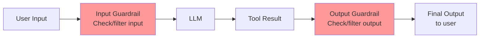

### guardrails_1.py — PII Redaction and Masking

**Scenario:** A customer service agent that has access to customer data including emails and credit card numbers.

The problem: if the agent returns this data directly, it's a security risk.

**Solution: PIIMiddleware**

```python
middleware=[
    # Emails are completely removed (redacted)
    PIIMiddleware(
        "email",
        strategy="redact",          # Replace with [REDACTED]
        apply_to_tool_results=True, # Filter tool output
        apply_to_output=True        # Filter final answer
    ),
    # Credit cards are partially hidden (masked)
    PIIMiddleware(
        "credit_card",
        strategy="mask",            # Replace digits with **** 
        apply_to_tool_results=True,
        apply_to_output=True
    )
]
```

**What the agent sees vs what the user gets:**

```
Tool returns:  {"email": "krishna_001@abc.com", "credit_card": "4111-1111-1111-1111"}
                                      ↓ Middleware processes
Final output:  Email: [REDACTED]  Credit Card: ****-****-****-1111
```

### guardrails_2.py — Block API Keys in User Input

**Scenario:** A coding assistant. What if a user accidentally pastes their API key into the chat?

```python
middleware=[
    PIIMiddleware(
        "api_key",
        detector=r"sk-[a-zA-Z0-9]{32}",  # Regex pattern to detect API keys
        strategy="block",                  # Stop everything, raise an error
        apply_to_input=True,               # Check user input before sending to LLM
    ),
]
```

If the user types: `"Here is my key sk-abc123...xyz help me debug"` → the middleware catches it and raises `PIIDetectionError` before the LLM ever sees the key.

```mermaid
graph TD
    U["User types:\n'My key is sk-abc123xyz...'"] --> GI[Input Guardrail\nRegex scanner]
    GI --> DET{Matches\nsk-[a-zA-Z0-9]{32}?}
    DET -->|YES| BLK[PIIDetectionError raised\nMessage blocked\nNever sent to LLM]
    DET -->|NO| LLM[LLM receives message\nSafe to continue]
    BLK --> WARN[User sees warning:\n'Your message contains a sensitive API key.\nUse os.getenv() instead']
```

### The Three Strategies

| Strategy | What Happens | Use When |
|----------|-------------|----------|
| `redact` | Replace with `[REDACTED]` | Emails, names — show it was there but hide value |
| `mask` | Replace digits with `****` | Credit cards — show format but hide numbers |
| `block` | Stop execution, raise error | API keys, passwords — nothing should get through |

---

## 13. How Everything Connects

Here is the complete architecture of the course from 30,000 feet:

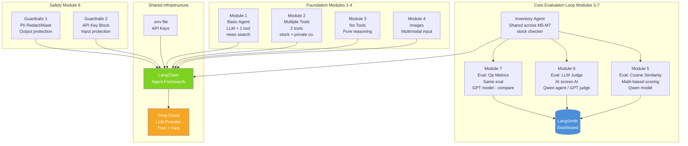

### The Progression of Complexity

```
Module 1: LLM + 1 tool          → Basic
Module 2: LLM + 2 tools         → Multiple tools
Module 3: LLM + 0 tools         → Pure reasoning
Module 4: LLM + images          → Beyond text
Module 5: Test it with math     → Evaluation starts
Module 6: Test it with AI       → LLM-as-judge
Module 7: Compare two models    → Model selection
Module 8: Add safety layers     → Production-ready
```

---

## 14. Cheat Sheet

### Common Patterns Used Throughout This Course

**Pattern 1: Load environment variables**
```python
from dotenv import load_dotenv
load_dotenv()
# After this, use os.getenv("KEY_NAME") to access your .env values
```

**Pattern 2: Create an LLM**
```python
from langchain_groq import ChatGroq
llm = ChatGroq(model="qwen/qwen3-32b", temperature=0)
# temperature=0 → deterministic (same input = same output every time)
```

**Pattern 3: Create a tool**
```python
from langchain.tools import tool

@tool
def my_tool(input: str) -> str:
    """Describe what this tool does — LLM reads this description!"""
    # Your actual Python logic here
    return result
```

**Pattern 4: Create an agent**
```python
from langchain.agents import create_agent

agent = create_agent(
    model=llm,
    tools=[tool1, tool2],
    system_prompt="You are a..."
)
```

**Pattern 5: Invoke an agent**
```python
result = agent.invoke({
    "messages": [{"role": "user", "content": "Your question here"}]
})
answer = result["messages"][-1].content  # -1 = last message = final answer
```

**Pattern 6: Traceable evaluation**
```python
from langsmith import traceable, evaluate

@traceable  # This logs every run to LangSmith
def target(inputs: dict) -> dict:
    answer = run(inputs["question"])
    return {"answer": answer}

evaluate(target, data="dataset_name", evaluators=[my_evaluator_function])
```

---

### What Makes a Good Agent?

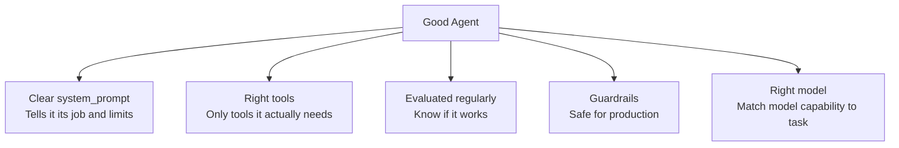

---

### The Mental Model — LLM vs Agent

```
LLM alone:    You ask a question → It answers from memory → Done

Agent:        You ask a question → 
              LLM thinks "what do I need?" →
              LLM calls tool(s) →
              Tool returns data →
              LLM uses data to form final answer →
              Done
```

The agent **loop** (think → act → observe → think again) is what makes agents powerful. They can interact with the real world through tools and refine their thinking based on what they find.

---

*These notes were generated from the course-gen-ai-main project by your tutor. Last updated: 2026-06-28.*
